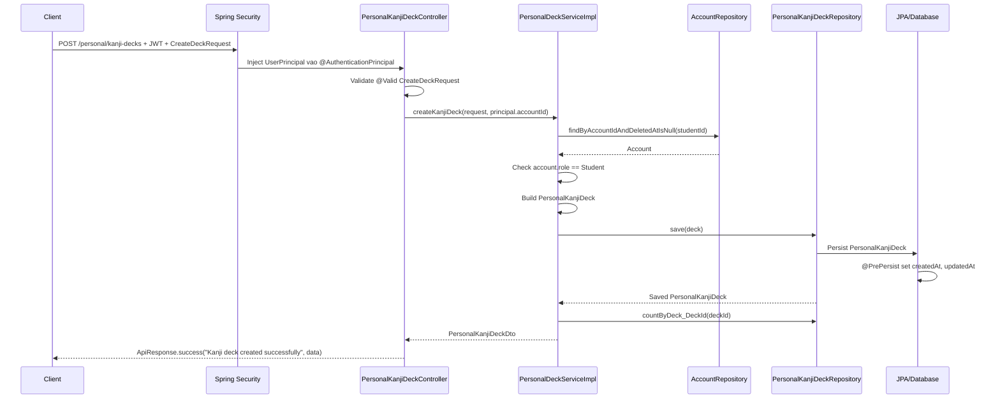

# Kanji Deck Main Flows

## Create New Kanji Deck

### API

- Method: `POST`
- Endpoint: `/personal/kanji-decks`
- Controller: `backend/src/main/java/com/example/base/controller/deck/PersonalKanjiDeckController.java`
- Request body:

```json
{
  "title": "N5 Kanji Review",
  "description": "Deck on tap kanji N5"
}
```

### Swimlane



### Detailed Code Positions

| Step | File | Lines | What happens |
| --- | --- | --- | --- |
| 1 | `backend/src/main/java/com/example/base/controller/deck/PersonalKanjiDeckController.java` | 15-18 | Khai bao REST controller, base path `/personal/kanji-decks`, va role duoc phep goi endpoint bang `@PreAuthorize`. |
| 2 | `backend/src/main/java/com/example/base/controller/deck/PersonalKanjiDeckController.java` | 20 | Inject `PersonalDeckService`. |
| 3 | `backend/src/main/java/com/example/base/dto/deck/DeckDtos.java` | 16-23 | DTO `CreateDeckRequest`: `title` bat buoc, toi da 150 ky tu; `description` toi da 500 ky tu. |
| 4 | `backend/src/main/java/com/example/base/controller/deck/PersonalKanjiDeckController.java` | 32-35 | Nhan `POST /personal/kanji-decks`, validate request bang `@Valid`, lay user dang login qua `@AuthenticationPrincipal UserPrincipal principal`. |
| 5 | `backend/src/main/java/com/example/base/security/UserPrincipal.java` | 21, 39-46 | `UserPrincipal` giu `accountId`; principal duoc tao tu `Account` sau khi authenticate. |
| 6 | `backend/src/main/java/com/example/base/controller/deck/PersonalKanjiDeckController.java` | 35 | Goi `deckService.createKanjiDeck(request, principal.getAccountId())`. |
| 7 | `backend/src/main/java/com/example/base/service/deck/PersonalDeckService.java` | 17 | Interface dinh nghia contract `createKanjiDeck(CreateDeckRequest request, Long studentId)`. |
| 8 | `backend/src/main/java/com/example/base/service/deck/impl/PersonalDeckServiceImpl.java` | 16-18 | Service bean chay trong transaction read-only mac dinh; method create se override bang `@Transactional`. |
| 9 | `backend/src/main/java/com/example/base/service/deck/impl/PersonalDeckServiceImpl.java` | 23, 27 | Inject `PersonalKanjiDeckRepository` de save deck va `AccountRepository` de load student. |
| 10 | `backend/src/main/java/com/example/base/service/deck/impl/PersonalDeckServiceImpl.java` | 113-115 | Bat dau method `createKanjiDeck`, co `@Transactional` de cho phep ghi database. |
| 11 | `backend/src/main/java/com/example/base/service/deck/impl/PersonalDeckServiceImpl.java` | 116-120 | Build entity `PersonalKanjiDeck`: set `student`, `title.trim()`, `description` da trim hoac null. |
| 12 | `backend/src/main/java/com/example/base/service/deck/impl/PersonalDeckServiceImpl.java` | 173-178 | `requireStudent(studentId)` tim account chua bi xoa; neu role khac `Student` thi throw `BadRequestException`. |
| 13 | `backend/src/main/java/com/example/base/repository/AccountRepository.java` | 26 | Query method `findByAccountIdAndDeletedAtIsNull(Long accountId)` dung de lay student hop le. |
| 14 | `backend/src/main/java/com/example/base/service/deck/impl/PersonalDeckServiceImpl.java` | 229-232 | `trimToNull(description)`: null/blank thanh null, nguoc lai trim space. |
| 15 | `backend/src/main/java/com/example/base/service/deck/impl/PersonalDeckServiceImpl.java` | 121 | Save deck bang `kanjiDeckRepository.save(deck)`, sau do map sang response DTO. |
| 16 | `backend/src/main/java/com/example/base/repository/PersonalKanjiDeckRepository.java` | 9 | Repository ke thua `JpaRepository<PersonalKanjiDeck, Long>`, nen co san method `save`. |
| 17 | `backend/src/main/java/com/example/base/entity/PersonalKanjiDeck.java` | 8-20 | Entity map table `PersonalKanjiDeck`, primary key `deck_id` auto increment. |
| 18 | `backend/src/main/java/com/example/base/entity/PersonalKanjiDeck.java` | 22-30 | Columns duoc persist: `student_id`, `title`, `description`. |
| 19 | `backend/src/main/java/com/example/base/entity/PersonalKanjiDeck.java` | 32-47 | JPA lifecycle: truoc insert set `createdAt` va `updatedAt`; khi update set lai `updatedAt`. |
| 20 | `backend/src/main/java/com/example/base/service/deck/impl/PersonalDeckServiceImpl.java` | 199-205 | `toKanjiDeckSummary` tao `PersonalKanjiDeckDto`, gom `deckId`, `studentId`, `studentName`, `title`, `description`, `totalItems`, timestamps. |
| 21 | `backend/src/main/java/com/example/base/repository/PersonalKanjiDeckItemRepository.java` | 11 | `countByDeck_DeckId(deckId)` tinh `totalItems`; deck moi thuong la `0`. |
| 22 | `backend/src/main/java/com/example/base/dto/deck/DeckDtos.java` | 44-55 | Response DTO `PersonalKanjiDeckDto` chua data tra ve cho client. |
| 23 | `backend/src/main/java/com/example/base/dto/common/ApiResponse.java` | 34-40 | `ApiResponse.success(message, data)` dong goi response voi `code = 200`, message, data. |

### Success Response Shape

```json
{
  "code": 200,
  "message": "Kanji deck created successfully",
  "data": {
    "deckId": 1,
    "studentId": 10,
    "studentName": "Student Name",
    "title": "N5 Kanji Review",
    "description": "Deck on tap kanji N5",
    "totalItems": 0,
    "createdAt": "2026-08-19T10:00:00",
    "updatedAt": "2026-08-19T10:00:00"
  },
  "timestamp": "2026-08-19T03:00:00Z"
}
```

### Validation And Error Branches

| Case | Code position | Result |
| --- | --- | --- |
| Missing or blank `title` | `DeckDtos.java` lines 18-20 and controller line 33 with `@Valid` | Request fails validation before service logic. |
| `title` longer than 150 chars | `DeckDtos.java` line 19 | Request fails validation. |
| `description` longer than 500 chars | `DeckDtos.java` line 21 | Request fails validation. |
| User account not found or deleted | `PersonalDeckServiceImpl.java` lines 173-175 | Throws `ResourceNotFoundException("Account", "id", id)`. |
| Logged-in user is not `Student` | `PersonalDeckServiceImpl.java` line 176 | Throws `BadRequestException("Only students can own personal decks")`. |
| User does not have allowed authority | `PersonalKanjiDeckController.java` line 18 | Blocked by Spring Security before entering endpoint. |

### Main Data Mapping

| Request field | Entity field | DB column | Response field |
| --- | --- | --- | --- |
| `title` | `PersonalKanjiDeck.title` | `PersonalKanjiDeck.title` | `PersonalKanjiDeckDto.title` |
| `description` | `PersonalKanjiDeck.description` | `PersonalKanjiDeck.description` | `PersonalKanjiDeckDto.description` |
| Logged-in `principal.accountId` | `PersonalKanjiDeck.student` | `PersonalKanjiDeck.student_id` | `PersonalKanjiDeckDto.studentId`, `studentName` |
| Generated by DB/JPA | `PersonalKanjiDeck.deckId` | `PersonalKanjiDeck.deck_id` | `PersonalKanjiDeckDto.deckId` |
| Generated by `@PrePersist` | `createdAt`, `updatedAt` | `created_at`, `updated_at` | `createdAt`, `updatedAt` |
